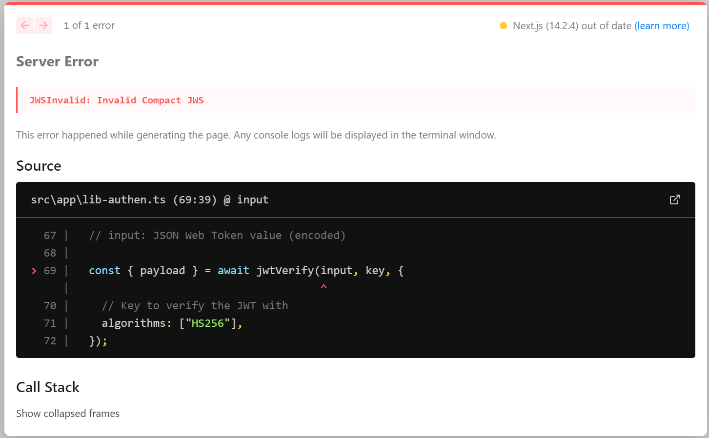

# Technical Documentation
Please read `README.md` at the root of this repository before viewing this.

## Logging in: Authentication & Authorisation
Only users who login successfully can access `/home`, `/record` and `/upload` pages. The set of valid username and passwords, which are hard coded for demonstration purposes, are found in `/frontend/src/app/mock-data.ts` . 

### Authentication
**Cookie-based** Authentication is used. This means that if a user is authenticated, a session cookie will be generated. Checking for (1) the presence of a session cookie and whether it can be (2) successfully decrypted indicates whether the users of the app are logged in.  

Code relating to authentication logic are mainly found in `/frontend/src/app/lib-authen.ts`. After user’s login credentials are verified, a JSON Web Token (JWT) containing the username information is generated, and assigned to a **session cookie**.    

The generation of JWT is assisted by the jose package used. Links to the information about the package & functions used in the code:
* About jose: https://github.com/panva/jose 
* jwtVerify: https://github.com/panva/jose/blob/main/docs/functions/jwt_verify.jwtVerify.md 
* SignJWT: https://github.com/panva/jose/blob/HEAD/docs/classes/jwt_sign.SignJWT.md   

JWT based on the username information is generated through `SignJWT(payload)` constructor. The hashing algorithm of the token can be defined as well, which HS256 algorithm is chosen herein. Both JWT token and the session cookie are set to be valid only for 24h. This means that **users will only be considered logged in for at most 24h OR when the user clicks logout, whichever is earlier**.   

Considering how the app checks whether users are logged in (paragraph 1), it may be said that users who wish to hack the system could falsify a session cookie by creating and storing a session cookie via the inspect element tool. However, before pages requiring authorization are loaded, the value stored in the session cookie will be attempted to be decrypted. If the value is not in the format of a valid JWT, a JWS Invalid error is thrown and caught via try-catch block. 

Indication of poor decryption by having errors being thrown informs the app that users are unauthorized (for more info, see code in `/frontend/src/middleware.ts`), preventing access  

Creating a session cookie with a value that correspond to a valid JWT has low chance of success especially when the key used for JWT should not be known, thus the risk of hackers accessing the system would be considerably low. **One outstanding issue is that the key/secretKey used is coded directly in `/frontend/src/app/lib-authen.ts` instead of utilising other management strategies to cover the secret key.**   

### Authorisation
 `/frontend/src/middleware.ts`contains the logic to show an error status of 401 unauthorised access is users who are not logged in access `/home`, `/record` and `/upload` pages. Logged-in users who attempts to go to `/login` page will be redirected to `/home` page.

## Recording at /record page
### API used to acceess Microphone
**MediaRecorder** interface of the MediaStream Recording API is used to connect to the device’s microphone. The recording functionality coded in here is unable to record system audio (i.e. audio played from the devices itself), it only records sounds from the surroundings.  

### Importance of HTTPS
In order for the recorder function to work on **mobile** browsers, the app must be hosted in secure context, e.g. HTTPS. `navigator.mediaDevices.getUserMedia() is undefined` error message will occur if done otherwise.  

### Back Button issue
<table>
One of the design features of the `/record` page is: 
At `/record` page, if users 
1. click on the browser’s back/forward button, OR
2. refresh the page OR
3. click on the Home or logout button in `/record` page 
while actively recording on the /record page (i.e. `recordingStatus !== INACTIVE`),   

dialog will be shown with 2 buttons (for e.g., “stay on page” and “ok”) to either remain on page or leave/reload the page. 

If users agree to leave the page, `stopRecording()` will be executed so that the microphone connected will stop recording. This is to prevent a case where the microphone continues to record while users are at other pages (`/home`, `/upload`, `/logout`) | 
</table>

Users are supposed to stay on the recording page in order to record. If users are to leave the page, the recording will be terminated. However, if users press **the back button** on their browsers, the current codebase is unable to detect it and terminate the recording. This is a "bug" that require looking into.  

<u>Detailed Explanation on the issue</u>

## Uploading at /upload page
talk about the different mobile interfaces (and the UA Parser)

## Miscellaneous
### Use of h tags
h1: main heading of the page. They are
* "Transcription Service” in `/login` page
*	“Welcome!” in `/home` page
*	“Record” in `/record` page
*	“Upload” in `/upload` page
The descriptions below these headings, if applicable, are wrapped in p tags. 
 

h2: sub-heading. Examples of sub-headings used in the pages are:
* “Transcribed Text” in /record && /upload page
* “Login” in /login page
* “Select files” in /upload page

h3: used for the account username shown in the side menu (only displayed when the screen max width is < 800px)

## Issues && Areas for Improvement
### Summary
•	* Strengthening Authentication (maybe it could be better, given JWT). It is of note that Authentication libraries like NextAuth and OAuth aren't used
•	* Press key down functionality
•	* Recording next button issue
•	* Code base: repetition && secret key

### Details
