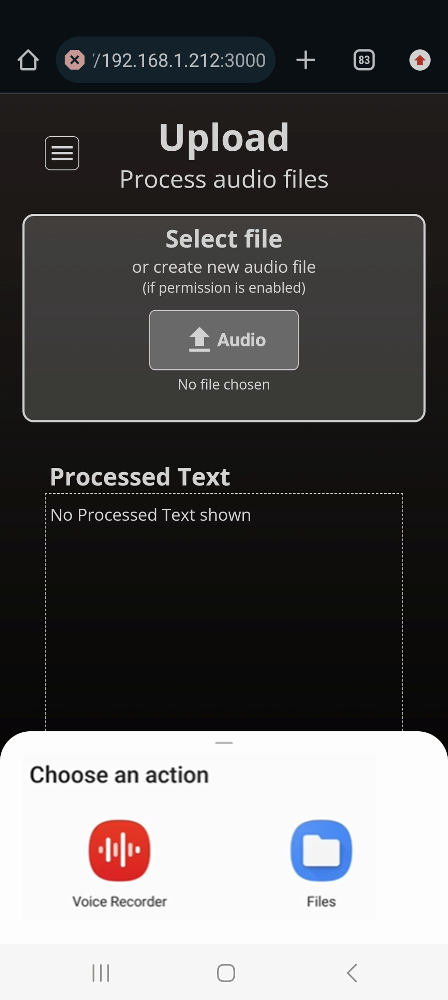

# Technical Documentation (Important ones only)
Please read [`README.md`](../README.md) before viewing this.  
_Last updated: 8 Aug 2024_ 
_Writen by: Chua Tse Hui (Intern) -- only those written before 8 Aug (inclusive)_ 

## Logging in: Authentication & Authorisation
Only users who login successfully can access `/home`, `/record` and `/upload` pages. The set of valid username and passwords, which are hard coded for demonstration purposes, are found in [`frontend/src/app/mock-data.ts`](../frontend/src/app/mock-data.ts). 

### Authentication
**Cookie-based** Authentication is used. This means that if a user is authenticated, a session cookie will be generated. Checking for 
* (1) the presence of a session cookie and whether it can be 
* (2) successfully decrypted

indicates whether the users of the app are logged in.  

Code relating to authentication logic are mainly found in [`frontend/src/app/lib-authen.ts`](../frontend/src/app/lib-authen.ts). After user’s login credentials are verified, a JSON Web Token (JWT) containing the username information is generated, and assigned to a **session cookie**.    

The generation of JWT is assisted by the jose package used. Links to the information about the package & functions used in the code:
* About jose: https://github.com/panva/jose 
* jwtVerify: https://github.com/panva/jose/blob/main/docs/functions/jwt_verify.jwtVerify.md 
* SignJWT: https://github.com/panva/jose/blob/HEAD/docs/classes/jwt_sign.SignJWT.md   

JWT based on the username information is generated through `SignJWT(payload)` constructor. The hashing algorithm of the token can be defined as well, which HS256 algorithm is chosen herein. Both JWT token and the session cookie are set to be valid only for 24h. This means that **users will only be considered logged in for at most 24h OR when the user clicks logout, whichever is earlier**.   

Considering how the app checks whether users are logged in (paragraph 1 of Authentication section), it may be said that users who wish to hack the system could falsify a session cookie by creating and storing a session cookie via the inspect element tool. However, before pages requiring authorization are loaded, the value stored in the session cookie will be attempted to be decrypted. If the value is not in the format of a valid JWT, a JWS Invalid error is thrown (picture below shows how it looks like *without* being caught for exception handling) and caught via try-catch block (exception handling). 

Indication of poor decryption by having errors being thrown and handled informs the app that users are unauthorized (for more info, see code in [`frontend/src/middleware.ts`](`../frontend/src/middleware.ts`)), preventing access.  

Creating a session cookie with a value that correspond to a valid JWT has low chance of success especially when the key used for JWT should not be known, thus the risk of hackers accessing the system would be considerably low. **One outstanding issue is that the key/secretKey used is coded directly in [`frontend/src/app/lib-authen.ts`](../frontend/src/app/lib-authen.ts) instead of utilising other management strategies to cover the secret key.**   

### Authorisation
 [`frontend/src/middleware.ts`](../frontend/src/middleware.ts) contains the logic to show an error status of 401 unauthorised access when users who are not logged in attempt to access `/home`, `/record` and `/upload` pages. Logged-in users who attempts to go to `/login` page will be redirected to `/home` page.

### Other libraries?
(sufficiently) Popular Authentication libraries such as NextAuth and OAuth are possible choices which were not chosen. Admittedly, the reason for that was I did not think of that at that point in time. 
 

## Recording at /record page
### API used to acceess Microphone
**MediaRecorder** interface of the MediaStream Recording API is used to connect to the device’s microphone. The recording functionality coded in here is unable to record system audio (i.e. audio played from the devices itself), it only records sounds from the surroundings.  

### Importance of HTTPS
In order for the recorder function to work on **mobile** browsers, the app must be hosted in secure context, e.g. HTTPS. `navigator.mediaDevices.getUserMedia() is undefined` error message will occur if done otherwise.  

### Back Button issue
<b>One of the Design feature of the `/record` page is:</b>
***
At `/record` page, if users 
1. click on the browser’s back/forward button, OR
2. refresh the page OR
3. click on the Home or logout button in `/record` page 
while actively recording on the `/record` page (i.e. `recordingStatus !== INACTIVE`),   

dialog will be shown with 2 buttons (for e.g., “stay on page” and “ok”) to either remain on page or leave/reload the page. 

If users agree to leave the page, `stopRecording()` will be executed so that the microphone connected will stop recording. This is to prevent a case where the microphone continues to record while users are at other pages (`/home`, `/upload`, `/login`) 
***
This functionality has been implemented successfully except for scenario 1 -- pressing of browser's button. Currently, `stopRecording()` _may or may not_ be executed when the browser's back button is pressed, depending on the situation. The following describes the the situation:  

* **`stopRecording()` will be executed** : if users access `/record` page by **keying in the URL address** in the browser search bar, and then click back.
    * `stopRecording()` written in the `beforeUnload(e: BeforeUnloadEvent)` function which is written in the `useEffect` hook was executed (Code found in [`frontend/src/app/(sub-pages)/record/record-audio.tsx`](../frontend/src/app/(sub-pages)/record/record-audio.tsx)). This `useEffect` hook allows window to keep listening for BeforeUnloadEvent
    * this means that BeforeUnloadEvent will be triggered when browser's back buton is pressed, Only if `/record` page was accessed via URL. Hence (next bullet point):   
* **`stopRecording()` fails** : if users access `/record` page by **clicking the button in the app** (Record button in `/home` page), and then clicking browser's back button.
    * given this phenomenon, [BeforeUnloadEvent](https://developer.mozilla.org/en-US/docs/Web/API/Window/beforeunload_event) may not have been fired.

A possible reason is how navigation works in NextJS -- it's client-side navigation, but it also possibly is:
> a mixture of SPA (Single Page Appplication) style navigation and traditional navigation. 

Or maybe, it can be said as  

> By default, Next.js pre-renders every page. This means that Next.js generates HTML for each page in advance, instead of having it all done by client-side JavaScript. Pre-rendering can result in better performance and SEO (Search Engine Optimisation). 

When users access the `/record` page via URL link, the console in the inspect element tool gets refreshed. When users access the `/record` page via the buttons in the app from `/home` page, the console in the inspect element tool does NOT get refreshed. It's thus inferred that a request to the server has been made to regenerate the HTML page when `/record` page is accessed via URL link, thus clicking the browser's back button may result in unloading the html page (just a wild guess). In contrast to accessing the `/record` page via the app button, there seems to have no request made to the server and it is a matter of utilising JavaScript to render the parts that is changed (the idea behind client-side routing). Thus when clicking the browser's back button, there is no BeforeUnloadEvent to listen for.  

References where I got my information from:
* General overview between server side vs client side routing: https://www.telerik.com/blogs/server-side-routing-vs-client-side-routing
* Understanding NextJS routing (app router): https://nextjs.org/docs/app/building-your-application/routing/linking-and-navigating#how-routing-and-navigation-works
* 1st paragraph in link mentioned about pre-rendering of page: https://nextjs.org/docs/pages/building-your-application/rendering
* Supplementary info: https://stackoverflow.com/questions/64644248/next-js-client-side-navigation-vs-changes-in-html

I thought if listening for PopState event (which is meant to be fired when "the active history entry changes while the user navigates the session history") can be a solution, since when users press the browser's back button, the user is navigating through the session history stack, one step back. However, I wasn't able to do it successfully. PopState event does not seem to be fired.  

In this link: https://github.com/vercel/next.js/discussions/41934#discussioncomment-8996669, it mentioned that  
> It’s worth mentioning there’s no browser behavior to prevent popstate (back or forward navigations), so there isn’t a way to add that to the router.

This suggests that routing in app router cannot listen for events, limiting the possibility of a solution to detect the back button. Listening for events in routing was available in page router. Reverting the codebase to page router comes with certain considerations:
* NextJS seems to suggest that page router is meant to be of the past and that people should use app router. (However, online says that page router are still getting new updates). Page router still exists to help with older apps using it. Thus in terms of looking ahead, it may be better to stick with app router.
* It's possible to use both page and app router. But utilising both routing methods does not sound seamleass: https://nextjs.org/docs/app/building-your-application/routing/linking-and-navigating#7-routing-between-pages-and-app

Potentially, **one can use the [`use-router-with-events`](https://www.npmjs.com/package/use-router-with-events) package to allow the router in app router to manipulate code when listening to events**. This method has not been tried, which one may consider.  

It was also thought whether it is possible to do this instead: When users enter `/home` page, the code checks whether the microphone is still currently connected and has started recording. If it is still recording, stop the recorder. As microphone access is only coded in `/record` page, for `/home` page to access the microphone, the microphone Ref stored need to exist not just in `/record` but elsewhere too. This led to the use of `useContext`. This method was attempted but failed, nonetheless the code for it can be found in [`frontend/src/app/(code-not-used)/microphone.tsx`](../frontend/src/app/(code-not-used)/microphone.tsx) under Attempt 2 part.

## Uploading at /upload page
### Determining mobile vs desktop
If the web app is accessed via computer / desktop, upon pressing the upload button, only the file picker is shown which users can choose audio files for uploading.  
But if the app is accessed via **mobile device**, upon pressing the upload button, **BOTH the file picker and voice recorder options** are shown (see picture below) which users can choose to either select an existing audio file via the file picker for uploading or to create an audio file on the spot through voice recording. The voice recorder option is shown only if users enable permission settings for the web app to access microphone / voice recorder option (based on memory recall)  

Online research suggests that it is not possible to disable the voice recorder option. The behaviour of file upload is due to the `<input type = "file">` tag. The tag in [`frontend/src/app/(sub-pages)/upload/upload-file.tsx`](../frontend/src/app/(sub-pages)/upload/upload-file.tsx) has the `accept` attribute written as `accept="audio/*"`. While it is possible to disable the voice recorder option on mobile devices by changing the `accept` attribute to `accept="application/octet-stream"`, the corresponding file type restricted for user selection will be inaccurate thus this solution was not used.  

Given that voice recorder and file picker options were given, it is necesary to explain the potential difference between `/record` and `/upload` pages. For `/record` page, it is believed that as recording take place, the already collected audio data will be sent to the backend for transcription without having to wait for all audio data to be collected (i.e. recording has stopped) before it can be sent to the backend. This stands in contrast with `/upload` page voice recorder option which users will have to record for the entire duration, and have the entire audio file to be selected before it is sent to the backend.  

Given that desktop / computer devices show only the file picker option while mobile devices show both options, in terms of user interface design, it is necessary that the frontend design is to be slightly different.

To detect whether the device is mobile or computer, [`UAParser.js`](https://github.com/faisalman/ua-parser-js) package is utilised which helps to elicit userAgent information in a more readable and clean manner as opposed to seiving out information from executing `navigator.userAgent` directly. The code logic for detecting mobile or desktop through this library is written in [`frontend/src/app/lib-device.ts`](../frontend/src/app/lib-device.ts).  

However, users who access the app on browsers on mobile phones but with the desktop view activated will not be detected that they are accessing the app on a browser on mobile device. To mitigate this, `useEffect` hook in [`frontend/src/app/(sub-pages)/upload/upload-file.tsx`](../frontend/src/app/(sub-pages)/upload/upload-file.tsx) was written to further check whether the browser is on a touchscreen. Some schematic details are shown on how they might work together:

**Flowchart: How `UAParser.js` and the `useEffect` hook work together**

Browser on Desktop (touchscreen, landscape) should be detected correctly as the UAparser should be able to detect the userAgent as a browser on Desktop. Or at least, not mobile (e.g. Windows). 

Browser on Mobile (Desktop view, portrait) would be detected as a Desktop instead of mobile via UAparser. But from the `useEffect` hook, the code would notice that `navigator.maxTouchPoints > 0`, and thus will later deduce that it is Browser on Mobile.  

However, this means that Browser on Desktop (Touchscreen portrait) will be categorised correctly as Desktop at first. But because how the inference is that undefined types returned from `UAParser.js` could mean both Desktop Browser or Mobile Browser with Desktop view, `useEffect` logic is meant to further categorise it. Based on the logic in `useEffect`, Browser on Desktop (touchscreen and portrait) fulfil the criteria in `useEffect` hook and will be classified as Mobile, which then is inaccurate. However, it should be rare for users to have browsers on Desktop (touchscreen) but in portrait mode.  

Based on the logic coded in the `useEffect` hook, browser on mobile with desktop view in landscape likewise will not be able to be detected as mobile. This should be alright as mobile phones should, more often than not, used in portrait mode. 

**Assumption made:**
* All and Only touchscreen devices have `navigator.maxTouchPoints > 0`
* No one uses Desktop touchscreen in portrait mode

While `window.matchMedia(query)` could be used to check for the screen size and thus determine if it is mobile or desktop, the limitation is that the screen dimension registered for mobile with desktop view will be changed to model after desktop view, thus the screen dimensions do exceed mobile typical screen dimensions. Such a solution will not be viable. 

All these logic and inference as to which browsers will be detected correctly may only be reliable claims only if we consider desktop / computer vs mobile phones, with no consideration for medium sized devices like tablets and iPads. It is not tested how `UAParser.js` detect browsers on other devices that are not considered mobile (mobile tend to be considered of smaller size than tablets/iPads).

## Miscellaneous
### Use of h tags
h1: main heading of the page. They are
* "Transcription Service” in `/login` page
*	“Welcome!” in `/home` page
*	“Record” in `/record` page
*	“Upload” in `/upload` page

The descriptions below these headings, if applicable, are wrapped in p tags. 
 

h2: sub-heading. Examples of sub-headings used in the pages are:
* “Transcribed Text” in `/record` && `/upload` page
* “Login” in `/login` page
* “Select files” in `/upload` page

h3: used for the account username shown in the side menu (only displayed when the screen max width is < 800px) 

### Responsive Design
No additional library was used to specifically enable responsive design. Plain CSS @media queries were used.